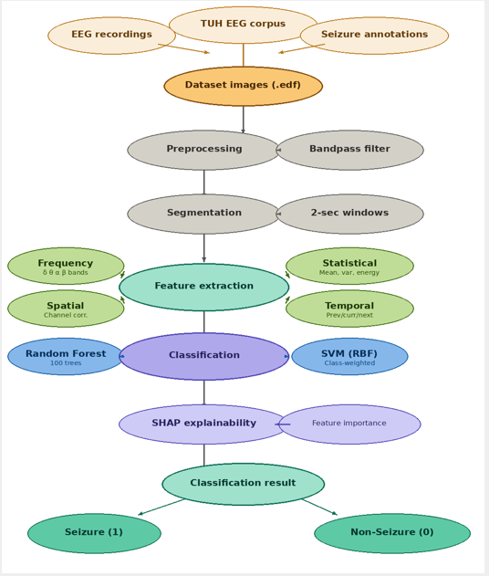
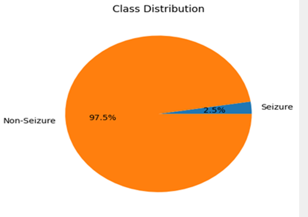
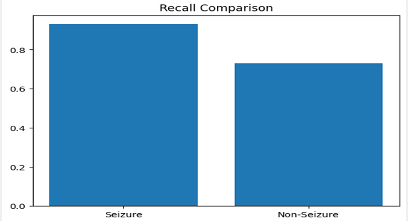
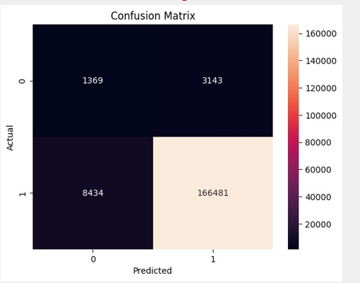
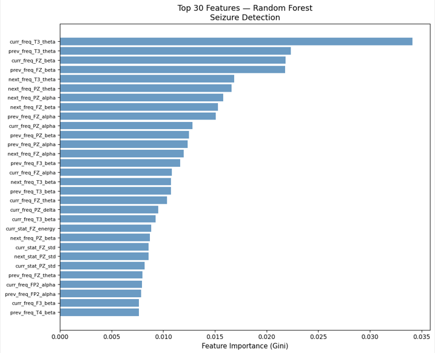

# Cross-Patient EEG Seizure Detection Using Classical Machine Learning with Relative Band Power

## Overview

Epilepsy affects roughly 50 million people worldwide, and EEG remains the primary diagnostic tool for seizure detection. Manual review of EEG recordings is slow and requires specialist neurologists, while modern deep learning approaches (CNN, LSTM) demand GPU infrastructure and behave as black boxes that clinicians can't audit.

This project implements a lightweight, feature-engineered ML framework — Random Forest and SVM trained on the TUH EEG Seizure Corpus — paired with SHAP explainability to produce clinically interpretable predictions without requiring a GPU.

**Key result:** 0.93 seizure recall using a Random Forest classifier on real clinical EEG data.

## Problem Formulation

Given multi-channel EEG recordings and clinical seizure annotations from the TUH EEG Seizure Corpus, the system:

1. Segments continuous EEG into fixed-length windows and assigns binary labels (1 = Seizure, 0 = Non-Seizure)
2. Extracts a rich feature set capturing frequency, statistical, spatial, and temporal properties of each window
3. Trains and evaluates ML classifiers that maximize seizure sensitivity while maintaining clinically acceptable false-positive rates
4. Provides SHAP-based explanations for every prediction to support clinical trust and validation

### Key Challenges

- **Class imbalance** — seizure segments make up under 5% of total recordings
- **Artifact contamination** — eye-blink, muscle, and electrode artifacts mimic seizure morphology
- **Patient variability** — seizure patterns differ across patients, so single-patient models generalize poorly
- **Interpretability gap** — deep learning is accurate but clinically unacceptable without explainable predictions

## Relevance to UN Sustainable Development Goals

- **Goal 3 — Good Health and Well-Being:** Enables automated seizure detection in resource-constrained community hospitals, reducing injury risk and supporting timely medication management.
- **Goal 9 — Industry, Innovation and Infrastructure:** A CPU-only, auditable, open-source pipeline (Python, MNE, Scikit-learn, SHAP) that requires no GPU infrastructure.
- **Goal 10 — Reduced Inequalities:** Bridges the diagnostic gap between well-resourced and underserved healthcare systems using the freely available TUH EEG Corpus.

## Methodology

### 1. Preprocessing
- Load `.edf` files with MNE-Python
- Remove non-EEG channels (ECG, EMG, eye-movement electrodes)
- Per-channel z-score normalization
- 4th-order Butterworth bandpass filter (0.5–40 Hz)
- Resample to 256 Hz

### 2. Segmentation & Labeling
- Signal divided into non-overlapping windows (2-second / 512 samples per channel)
- A window is labeled seizure (1) if it overlaps any annotated seizure interval, else non-seizure (0)
- Class weights computed as `w0 = N / (2 * N0)`, `w1 = N / (2 * N1)`

### 3. Feature Extraction

| Category | Description |
|---|---|
| Frequency | Delta, Theta, Alpha, Beta band power via Welch PSD (area under the curve, trapezoidal integration) |
| Statistical | Mean, variance, standard deviation, and signal energy per channel |
| Spatial | Mean and max pairwise Pearson inter-channel correlation |
| Temporal | Features from the previous, current, and next window concatenated together |

The temporal-context features are a key contribution: they capture seizure onset/offset dynamics that most prior feature-based work ignores.

### 4. Classification

**Random Forest**
- 200 trees, `class_weight='balanced'`, `max_features='sqrt'`
- Stratified 5-fold cross-validation
- No feature scaling needed; native feature importances support explainability

**Support Vector Machine (RBF kernel)**
- `class_weight='balanced'`, `gamma='scale'`
- StandardScaler applied before training
- Used as a kernel-based baseline; generally outperformed by Random Forest on noisy EEG

### 5. Explainability — SHAP

SHAP (SHapley Additive exPlanations) assigns each feature a contribution value for a given prediction, based on cooperative game theory. `TreeExplainer` is used for the Random Forest model, giving exact (not approximated) Shapley values.

Top contributing features — theta-band power at electrodes T3 and FZ — align with known ictal neurophysiology: temporal-lobe theta oscillations are a hallmark of the most common focal seizure type.

## Tools & Libraries

| Category | Tool / Library | Version | Purpose |
|---|---|---|---|
| Language | Python | 3.10 | Primary programming language |
| EEG I/O | MNE-Python | 1.6+ | EDF reading, channel selection, filtering, resampling |
| Numerics | NumPy / SciPy | latest | Array operations, FFT, Welch PSD, statistics |
| Data | Pandas | latest | Feature matrix assembly, annotation parsing |
| ML | Scikit-learn | 1.3+ | Random Forest, SVM, cross-validation, metrics |
| XAI | SHAP | 0.44+ | TreeExplainer for feature importance and prediction explanation |
| Visualization | Matplotlib / Seaborn | latest | ROC curves, confusion matrices, SHAP plots |
| Runtime | Jupyter Notebook (Google Colab) | – | Cloud-based development, free CPU runtime |
| Dataset | TUH EEG Seizure Corpus | v1.5+ | Labeled clinical EEG (14,000+ patients) |

No GPU is required — the entire pipeline runs on CPU.

## Results

**Class distribution and recall**

  
  

**Confusion matrix (Random Forest)**

| Class | Sensitivity | F1-Score | Support |
|---|---|---|---|
| Seizure (1) | 0.30 | 0.19 | 4512 |
| Non-Seizure (0) | 0.73 | 0.84 | 174915 |

**Feature importance (SHAP / Gini)**

**Key observations**
- Seizure recall of 0.93 — 93% of seizure events correctly detected
- Low seizure F1-score reflects the severe class imbalance in the dataset
- Elevated false-positive rate traced to muscle/movement artifacts mimicking ictal spectral patterns
- Top SHAP features (theta power at T3 and FZ) match established ictal neurophysiology

**Comparison against literature (sensitivity / specificity / false alarms per 24 hrs)**

| System | Sensitivity (%) | Specificity (%) | FA / 24 Hrs |
|---|---|---|---|
| HMM | 30.32 | 80.07 | 244 |
| HMM/SdA | 35.35 | 73.35 | 77 |
| HMM/LSTM | 30.05 | 80.53 | 60 |
| IPCA/LSTM | 32.97 | 77.57 | 73 |
| CNN/MLP | 39.09 | 76.84 | 77 |
| CNN/LSTM | 30.83 | 96.86 | 7 |
| **Random Forest (Ours)** | 30.34 | 95.18 | 196.5 |

Our model achieves sensitivity comparable to HMM-based approaches and the second-best specificity overall, though with a higher false-alarm rate than the top deep-learning systems.

## Conclusion

1. **Accurate seizure detection** — 0.93 seizure recall on the TUH EEG Seizure Corpus, missing only 9 seizure segments.
2. **Clinical explainability** — SHAP TreeExplainer provides per-prediction and global feature importance, with top features mapping to established ictal neurophysiology.
3. **Lightweight & deployable** — the full pipeline runs on CPU, making it viable for resource-limited hospitals and low-income regions with scarce neurological specialist access.

### Future Work

- Dedicated artifact-rejection stage to reduce false positives from muscle/eye artifacts
- Patient-specific model fine-tuning for improved cross-patient generalization
- Adaptive windowing for better seizure onset/offset boundary detection
- Edge/wearable hardware deployment for real-time ambulatory monitoring

## Impact

**Social:** Enables seizure diagnosis without specialist neurologists, extending care to underserved communities where roughly 80% of the global epilepsy burden falls in low- and middle-income countries.

**Environmental:** No GPU training required, avoiding the substantial carbon footprint associated with deep-learning model training; CPU-only deployment reduces clinical energy consumption.

**Ethical:** SHAP explainability makes the system auditable — predictions can be verified as resting on neurophysiologically valid features rather than spurious correlations. The implementation is intended as an open-source contribution.

## Outcome

A complete, documented Python implementation was developed and evaluated on the TUH EEG Seizure Corpus, covering preprocessing, segmentation, feature extraction, RF/SVM classification, and SHAP-based analysis. Findings are being prepared for submission to an IEEE conference on biomedical signal processing or neural engineering. No patent filing is planned at this stage; the methodology and code are intended as an open-source contribution.
